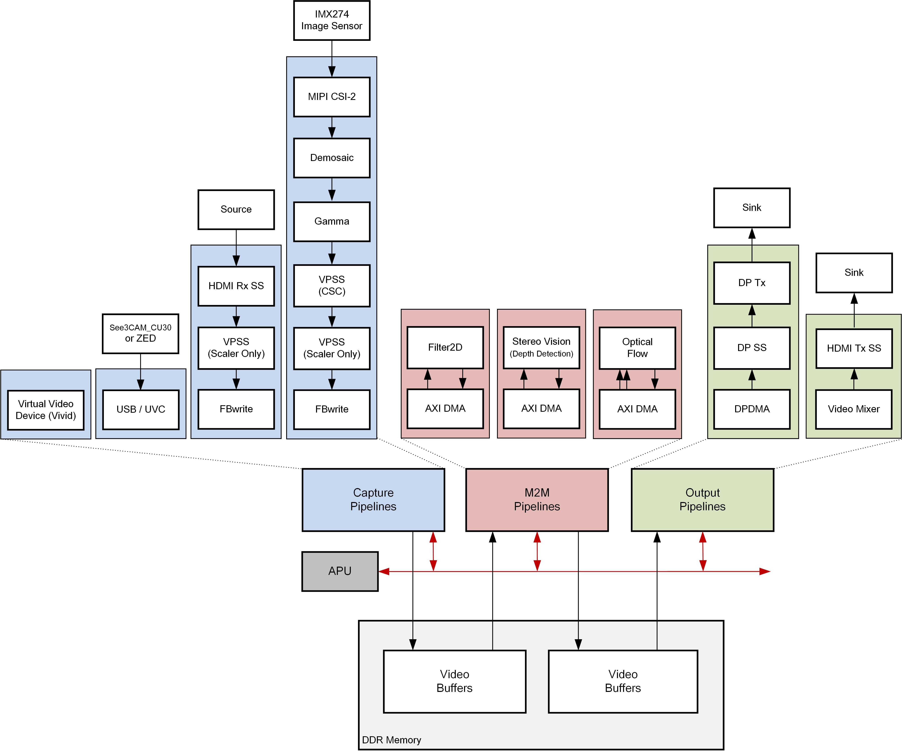
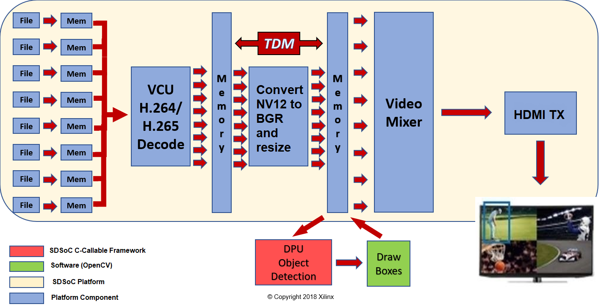

            Read this page in other languages:<a href="../Japanese-master/overview.md">日本語</a>    <table style="width:100%">
  <tr>

<th width="100%" colspan="6"><h1>reVISION Getting Started Guide 2018.3 (UG1265)</h1>
</th>

  </tr>
  <tr>
    <td width="17%" align="center"><a href="https://github.com/Xilinx/TechDocs/blob/reVISION-getting-started-develop/README.md">1. Introduction</a></td>
    <td width="16%" align="center">2. Overview</td>
    <td width="17%" align="center"><a href="software-tools-system-requirements.md">3. Software Tools and System Requirements</a></td>
    <td width="17%" align="center"><a href="design-file-hierarchy.md">4. Design File Hierarchy</a></td>
</tr>
<tr>
    <td width="17%" align="center"><a href="operating-instructions.md">5. Installation and Operating Instructions</a></td>
    <td width="16%" align="center"><a href="tool-flow-tutorials.md">6. Tool Flow Tutorials</a></td>
    <td width="17%" align="center"><a href="run-application.md">7. Run the Application</a></td>
    <td width="17%" align="center"><a href="platform-details.md">8. Platform Details</a></td>    
  </tr>
<tr>
    <td width="17%" align="center" colspan="2"><a href="known-issues-limitations.md">9. Known Issues and Limitations</a></td>
    <td width="16%" align="center" colspan="2"><a href="additional-references.md">10. Additional References</a></td>
</tr>
</table>

# 2. Overview

The figure below shows a block diagram of the reVISION single sensor design. Video sources (or capture pipelines) are shown on the left. Computer vision accelerators implemented as memory-to-memory (m2m) pipelines are shown in the middle. Video sinks (or output/display pipelines) are shown on the right.

The figure below shows a block diagram of the reVISION 8-stream VCU + CNN design. An 8-stream flow with time division multiplexing (TDM) is shown. This design is available on the ZCU104 board only.

## 2.1. Platforms

### 2.1.1. Single-Sensor Platform

The ZCU102/ZCU104 single-sensor reVISION platform supports the following video interfaces.

#### 2.1.1.1. Sources

  - USB2/3 camera up to 1080p60 or stereo 1080p30
    - The USB controller is part of the processing system (PS). It uses the standard Linux Universal Video Class (UVC) driver.
  - HDMI RX up to 4k60
    - The HDMI capture pipeline is implemented in the programmable logic (PL) and consists of the HDMI RX Subsystem, the Video Processing Subsystem (Scaler-only configuration), and the Frame Buffer Write IP. The HDMI RX Subsystem receives and decodes the HDMI data stream from an HDMI source and converts it to AXI4-Stream. The Video Processing Subsystem converts the incoming color format (RGB, YUV444, or YUV422) to YUV422 and optionally scales the image to the target resolution. The Frame Buffer Write IP writes the YUV422 stream to memory as packed YUYV format. The HDMI capture pipeline uses the V4L Linux framework.
  - MIPI CSI using an optional FMC card up to 4k60
    - The MIPI capture pipeline is implemented in the PL and consists of the Sony IMX274 image sensor, the MIPI CSI2 Subsystem, the Demosaic IP, the Gamma IP, the Video Processing Subsystem (CSC configuration), a Video Processing Subsystem (Scaler-only configuration), and the Frame Buffer Write IP. The IMX274 image sensor provides raw image data over the camera sensor interface (CSI) link. The MIPI CSI2 Subsystem receives and decodes the incoming data stream to AXI4-Stream. The Demosaic IP converts the raw image format to RGB. The Gamma IP provides per-channel gamma correction functionality. The VPSS-CSC provides color correction functionality. The VPSS-Scaler converts the RGB image to YUV422. The Frame Buffer Write IP writes the YUV422 stream to memory as packed YUYV format. The MIPI capture pipeline uses the V4L Linux framework.

#### 2.1.1.2. Sinks
* HDMI TX up to 4k60
  * The HDMI display pipeline is implemented in the PL and consists of the Video Mixer IP and the HDMI TX Subsystem. The Video Mixer is configured to read one ARGB and two YUYV layers from memory. In the provided design examples, only a single YUYV layer is used. The video layers are then composed and alpha-blended into a single output frame which is sent to the HDMI TX Subsystem using AXI4-Stream. The HDMI TX Subsystem encodes the incoming video into an HDMI data stream and sends it to the HDMI display. The HDMI display pipeline uses the DRM/KMS Linux framework.
* DP TX up to 4k30
   * The DP display pipeline is configured for dual-lane mode, and is part of the PS. It includes a simple two-layer blender with run-time programmable color format converters per layer. The two layers are always full screen, matching the target display resolution. The DP display pipeline uses the DRM/KMS Linux framework.

### 2.1.2. 8-Stream VCU + CNN Platform

   The ZCU104 8-stream VCU + CNN reVISION platform supports the following video interfaces.

#### 2.1.2.1. Sources
   * H.264/H.265 encoded File I/O   

#### 2.1.2.2. Sinks
   * HDMI TX
     * The HDMI display pipeline is implemented in the PL and consists of the Video Mixer IP and the HDMI TX Subsystem. The Video Mixer IP is configured to read one ARGB and eight BGR layers from memory. Each layer of mixer takes data dumped by DeePhi after machine learning and shows it over HDMI after mixing.

## 2.2. Design Examples

### 2.2.1. Single-Sensor Platform

The following examples input and output live video.
* Dense Optical Flow
  * Requires LI-IMX274MIPI-FMC _or_ HDMI source _or_ a See3CAM_CU30 USB camera.
   * This algorithm uses two successive images in time, and calculates the direction and magnitude of motion at every pixel position in the image. The calculation is a simple implementation of the Lucas–Kanade method for optical flow estimation. The optical flow algorithm returns two signed numbers at each pixel position, representing up or down motion in the vertical direction, and left or right motion in the horizontal direction. The brightness of the false-color output, from black up to bright color, indicates the magnitude of the motion, and the color indicates the direction.

* Stereo Vision (Depth Detection)
  * Requires a ZED USB stereo camera.
  * This algorithm uses two side-by-side images from the stereo camera taken at the same moment in time, and calculates the depth, or distance from the camera, at every pixel position in the image. The stereo block-matching algorithm calculates depth based on binocular parallax, similar to the way human eyes perceive depth. The depth map is coded in false colors. Objects far away appear deep blue. Closer and closer objects appear in rainbow succession green, yellow, orange, red, purple and finally white, closest to the camera.

* Filter2D
  * Requires LI-IMX274MIPI-FMC _or_ HDMI source _or_ a See3CAM_CU30 USB camera.
   * Convolution is a common image processing technique that changes the intensity of a pixel to reflect the intensities of the surrounding pixels. This is widely used in image filters to achieve popular image effects like blur, sharpen, and edge detection. The implemented algorithm uses a 3x3 kernel with programmable filter coefficients.

* Triple
  * Combines the above three designs in a single project (ZCU102 only).
   * All three designs are available at once in hardware. The test application provided sets up three pipelines from three independent video sources, using the three HW accelerated plugins, to three planes of the video mixer for output on the HDMI display.

The following table shows the performance matrix of the live I/O samples on the supported platforms:

| Sample  | **ZCU102** | **ZCU104** |
|----|----|----|
| filter2d | 2160p30 | 2160p30 |
| optical_flow | 2160p52 | 2160p30 |
| stereo | 1080p16 | 720p18 |

**:pushpin: NOTE**
Work to bring the performance on the ZCU104 up to par with the ZCU102 is ongoing.

### 2.2.2. 8-stream VCU + CNN Platform

This design performs the VCU decode of the H.264/H.265 file and passes the decoded stream to the DeePhi DNN Processing Unit (DPU) IP for machine learning. The example provided here is for traffic detection, where traffic detection along with traffic type classification is shown by a different color of box encircling pedestrians, cars, and cycles.

The decoded output of the VCU is NV12, and the input for the DPU IP is BGR. The resolution for DNN is 640x480, which might be different from the actual file; a VPSS subsystem is inserted in order to perform color space conversion and downscaling. The following table shows the performance matrix for this platform.

| Number of Parallel Streams | FPS per Stream |
|----|----|
| 8 | 9.2 |
| 7 | 10.4 |
| 6 | 12.3 |
| 4 | 20.3 |
| 2  |  25.8 |
| 1  | 26.4  |

:arrow_forward:**Next Topic:**  [3. Software Tools and System Requirements](software-tools-system-requirements.md)

:arrow_backward:**Previous Topic:**  [1. Introduction](https://github.com/Xilinx/TechDocs/tree/reVISION-getting-started-develop/README.md)

Copyright&copy; 2018 Xilinx

