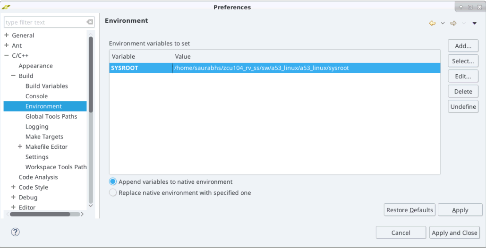
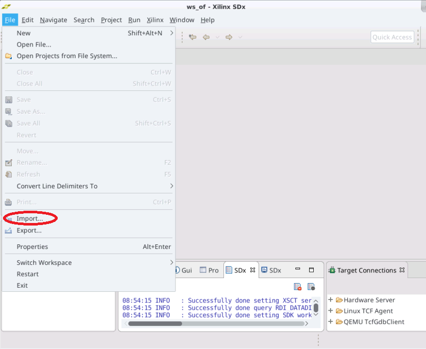
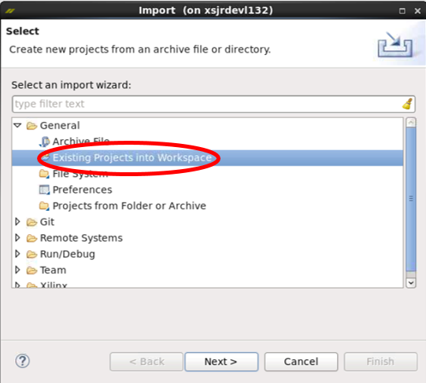
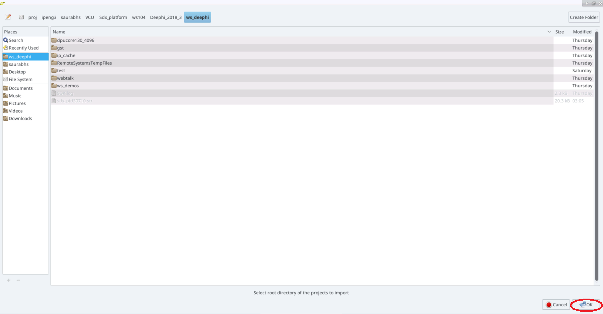
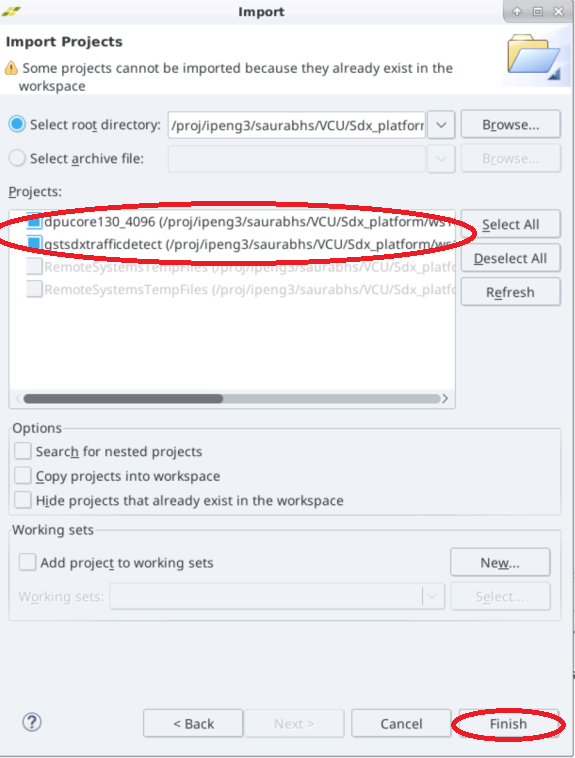
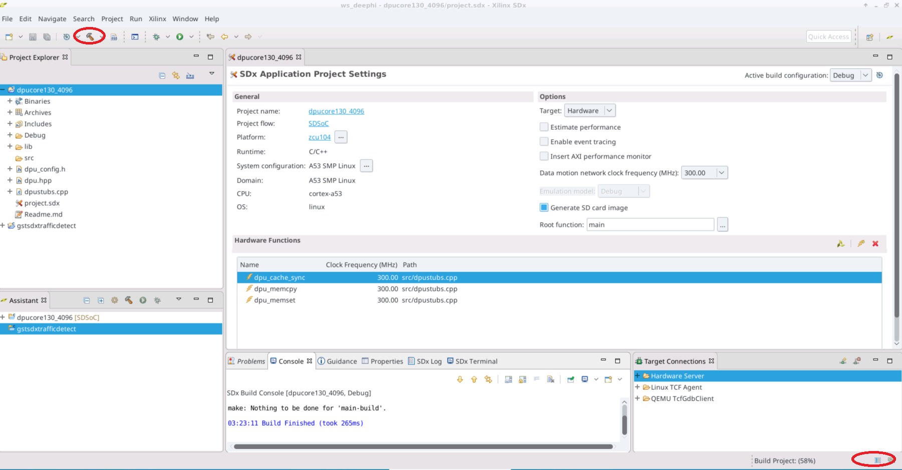
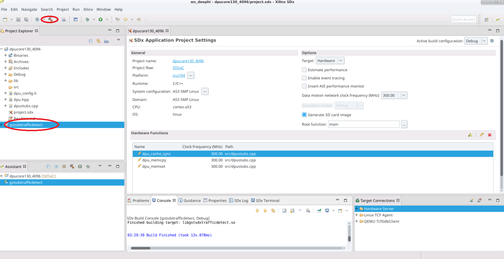

<p align="right">
            Read this page in other languages:<a href="../Japanese-master/tool-flow-tutorials.md">日本語</a>    <table style="width:100%"><table style="width:100%">
  <tr>

<th width="100%" colspan="6"><h1>reVISION Getting Started Guide 2018.3 (UG1265)</h1>
</th>

  </tr>
  <tr>
    <td width="17%" align="center"><a href="https://github.com/Xilinx/TechDocs/blob/reVISION-getting-started-develop/README.md">1. Introduction</a></td>
    <td width="16%" align="center"><a href="overview.md">2. Overview</a></td>
    <td width="17%" align="center"><a href="software-tools-system-requirements.md">3. Software Tools and System Requirements</a></td>
    <td width="17%" align="center"><a href="design-file-hierarchy.md">4. Design File Hierarchy</a></td>
</tr>
<tr>
    <td width="17%" align="center"><a href="operating-instructions.md">5. Installation and Operating Instructions</a></td>
    <td width="16%" align="center">6. Tool Flow Tutorials</td>
    <td width="17%" align="center"><a href="run-application.md">7. Run the Application</a></td>
    <td width="17%" align="center"><a href="platform-details.md">8. Platform Details</a></td>    
  </tr>
<tr>
    <td width="17%" align="center" colspan="2"><a href="known-issues-limitations.md">9. Known Issues and Limitations</a></td>
    <td width="16%" align="center" colspan="2"><a href="additional-references.md">10. Additional References</a></td>
</tr>
</table>

# 6. Tool Flow Tutorials

The SDx™ development environment, version 2018.3, must be installed and working on your host computer, in either the Linux or the Windows version. This guide walks you through the process of building the sample designs. In the [Software](software-tools-system-requirements.md#32-software ) step, you unzipped your platform files, and noted the exact directory paths.

The path to the extracted platform is required so that you can tell SDx where your custom platform resides. Set the `SYSROOT` environment variable to point to a directory inside the platform. The platform root directory is abbreviated to `<platform>` below and needs to be replaced with your local path:

* Linux: `export SYSROOT=<platform>/sw/a53_linux/a53_linux/sysroot/aarch64-xilinx-linux/`
* Windows: Go to **Start** → **Control Panel** → **System** → **Advanced** → **Environment Variables**. Create an environment variable `SYSROOT` with the value `<platform>/sw/a53_linux/a53_linux/sysroot/aarch64-xilinx-linux/`.

You can also set `SYSROOT` for all projects in the SDx environment by opening the **Window** menu, selecting **Preferences**, and adding a `sysroot` variable to **C/C++** → **Build** → **Environment**.



## 6.1. Single Sensor Flow
The single-sensor platform ships with five file I/O and three live I/O design examples demonstrating popular OpenCV functions accelerated on the programmable logic. A fourth live I/O example shows how to combine the other three live I/O designs into one design, allowing the three accelerated functions to reside and run in parallel in the FPGA.

With this release of reVISION, the live I/O sample design examples are based on GStreamer (see [GStreamer](https://gstreamer.freedesktop.org/)). The open-source GStreamer framework code is included with the reVISION platform, and design examples are built as GStreamer plugins. Code for test applications is provided as well, allowing you to compile apps that set up and run video pipelines using the plugins. Pipelines can be run using the `gst-launch-1.0` utility, or by your own app compiled against the Gstreamer libraries. An example test app called `gstdemo is provided for each of the platform samples. The four sample names are `filter2d`, `optical_flow`, `stereo`, and `triple`. See the `./workspaces/<name>/gst/apps/<name>` directory for each sample.

A GStreamer plugin is a shared library. In the case of the reVISION sample designs, the GStreamer plugin consists of two linked parts. These top and bottom parts are separate shared libraries produced by separate project builds. The top part is the GStreamer plugin itself, containing the code for interfacing with the GStreamer framework. See the `./workspaces/<name>/gst/plugins/<name>` directory. The top part links with the bottom part, which contains the code for the hardware accelerated function(s). This bottom project generates the `BOOT.BIN` file containing the programmable logic used for the hardware function(s). These are SDx projects; see the `./samples/live_IO/<name>` directory.

### 6.1.1. Build the Live I/O Optical Flow Sample Application

The following steps are virtually identical whether you are running the Linux or Windows version of SDx. There is a` ./workspaces/...` folder structure already set up for the four `live_IO` samples as part of the platform:
```
├── workspaces
│   ├── ws_f2d
│   ├── ws_of
│   ├── ws_sv
│   ├── ws_triple

```

Copy these workspaces to the directory where you want to work. Look at the `optical_flow` workspace area supplied with the platform. All files under `./gst/` are supplied exactly as shown. The `./opticalflow` directory is the SDx project you create to build the low-level accelerator code. You create this 'opticalflow' SDx project directly under the` ws_of` workspace. Note that `./gst/` is also directly under `./ws_of`:
```
├── ws_of
│   ├── gst
│   │   ├── apps
│   │   │   └── optical_flow
│   │   │       └── main.c
│   │   └── plugins
│   │       └── optical_flow
│   │          ├── gstsdxopticalflow.cpp
│   │          └── gstsdxopticalflow.h
│   └── opticalflow
│       └── src
│           ├── optical_flow_sds.cpp
│           └── optical_flow_sds.h

```

For a given workspace, such as `./ws_of/`, the arrangement of these subdirectories must be preserved. This is because the various projects depend on each other in that they need to know the paths to each other's include files and library files. As long as you keep this structure, you're OK; you can copy the `./ws_of/` tree with everything just as shown, and put it anywhere you want to work.

**:pushpin: NOTE**
>If you are working on Linux, there is no restriction on where you put these workspaces. Some people want to work directly in the` ./workspaces/` directory under the platform itself, and others prefer to copy it elsewhere so that the original area remains untouched.

>If you are working on Windows, there _is_ a restriction. File path lengths are restricted to 256 characters. The Xilinx build process creates deep directory structures with long names as it goes through the build process. You are advised, therefore, to keep the path to the workspace as short as possible, for example `C:\ws_of\...`.

#### 6.1.1.1. Import Existing Gstreamer Workspaces

1. Start SDx and select workspace `./ws_of`. Make sure you use the same shell to run the SDx environment as the one where you have set `$SYSROOT`. Close the Welcome screen and select **File** → **Import** → **General** → **Existing Projects into Workspace** →**Next**.





2. In the Import dialog, to the right of Select root directory, click **Browse**.


3.  By default, you are already in the directory you want; `./workspaces/ws_of`. Click **OK**.


4. You should see a list of projects with ``gstdemo`` and ``gstopticalflow`` selected. Click **Finish**.


5. Back at the main window, the imported project appears in the Project Explorer pane. Select **File** → **New** → **SDx Library Project...** from the menu bar.

#### 6.1.1.2. Create Library Application Project


1. In the Create a New SDx Library Project dialog, enter the project name, `opticalflow`, and click **Next**.


2. This brings up the Accelerated Library Type dialog box. Select **Shared Library**, and click **Next**.


#### 6.1.1.3. Add Custom Platform
1. In the Platform dialog, click **+**, and find your way to the top directory where you unzipped the single-sensor reVISION platform (for example, `zcu104_rv_ss`). Click **OK**.


2. Back in the Platform dialog, the new platform appears in the list, but is not selected. Select it, then click **Next**.


3. Click **Next** again in the next window.


#### 6.1.1.4. Select the Live I/O Sample
In the Templates dialog, under ``live_IO``, select **Dense Optical Flow** and click **Finish**.


Back again at the main window, the new project `opticalflow` appears under the four imported projects in the Project Explorer pane.

#### 6.1.1.5. Select the Release Build Configuration
Switch the Active Build Configuration for the `opticalflow` project to **Release**. Note that three routines are marked as hardware functions.


#### 6.1.1.6. Build the Project

Build the ``opticalflow`` project by right-clicking and choosing **Build Project**, or by clicking the hammer ( icon.

In the small Build Project dialog that opens, you can hit the **Run in Background** button. This causes the small dialog box to disappear, though you can still see a progress icon in the lower right part of the GUI, showing that work is in progress. Select the **Console** tab in the lower central pane of the GUI to observe the steps of the build process as it progresses. The build process can take up to several hours, depending on the power of your host machine, whether you are running on Linux or Windows, and the complexity of your design. By far, the most time is spent processing the routines that have been tagged for realization in hardware: note the HW functions window in the lower part of the SDx Project Settings pane. In the example above, the routines `read_optflow_input`, `DenseNonPyrLKOpticalFlow`, and `write_optflow_output` are tagged to be built in hardware. The synthesis of the C code found in these routines into the RTL, and the placement and routing of that RTL into the programmable logic in the Zynq® UltraScale+™ MPSoC, are the steps that take the most time.


When the build completes, an `sd_card` directory is created containing the following files that you'll need to transfer to your SD card:
  * `cp ./workspaces/ws_of/opticalflow/Release/sd_card/BOOT.BIN <sdcard>`
  * `cp ./workspaces/ws_of/opticalflow/Release/sd_card/libopticalflow.so <sdcard>`
  * `cp ./workspaces/ws_of/opticalflow/Release/sd_card/image.ub <sdcard>`
  * `cp ./workspaces/ws_of/gst/plugins/optical_flow/Debug/libgstsdxopticalflow.so <sdcard>`
  * `cp ./workspaces/ws_of/gst/apps/optical_flow/Debug/gstdemo <sdcard>`
Now that the bottom shared library is built, you can build the top part that will be linked with it. Select the `gstdemo` project and build it. Doing this builds both of the `gst---` projects.


### 6.1.2 Build the Stereo, Filter2D, and Triple Sample Applications

The Stereo, Filter2D, and Triple projects can be created and built using the method just detailed for the Optical Flow project, with the following differences:

1. Launch the SDx environment, starting in the appropriate workspace directory: `./workspaces/ws_sv`, `./workspaces/ws_f2d`, or `./workspaces/ws_triple`, respectively.
2. In the Templates dialog, select **Stereo Vision**, **Filter2D**, or **Optical Flow and Stereo**, respectively.
3. All the other steps are analogous.

### 6.1.3 Build the File I/O Sample Applications

1. Start the SDx environment and create a new workspace. Make sure you use the same shell to run SDx as the one where you have set ``$SYSROOT``.

2. Close the Welcome screen and select **File** → **New** → **SDx Project...** from the menu bar. Select **Application Project** and click **Next**. This brings up the Create a New SDx Project dialog box. Enter a name for the project (for example, ``bil_fil``, which stands for bilateral filter).


3. Leave the Use default location box checked and hit **Next** to open the Platform page.
4. Select the platform. The very first time you do this for a new workspace, you must hit **Add Custom Platform** (see [Add Custom Platform](#6113-add-custom-platform)) and select the custom platform.


5. Select the custom platform (for example, ``zcu102_es2_rv_ss (custom)``), and hit **Next**. This opens the System Configuration page.


6. Leave everything as-is, and hit **Next** to opens the Templates page. Select **bilateral – File I/O** from the set of templates and click **Finish**.


7. The dialog box closes, and you now see the SDx Project Settings pane in the center of the SDx integrated development environment (IDE). Notice the C/C++ Indexer progress bar in the lower right border of the pane, and wait a few moments for this to finish. In the upper-right corner of the pane, you can see that the current active build configuration is set to Debug. Click on **Debug** and change it to **Release**. Your window should now look like this:


8. In the Project Explorer pane on the left hand side, select the ``bil_fil`` project, right-click on it, and select **Build Project**. The hammer ( icon in the menu bar also performs Build Project. In the small Build Project dialog that opens, you can hit the **Run in Background** button. This causes the small dialog box to disappear, though you can still see a progress icon in the lower right part of the GUI, showing that work is in progress. Select the Console tab in the lower central pane of the GUI to observe the steps of the build process as it progresses. The build process can take up to several hours, depending on the power of your host machine, whether you are running on Linux or Windows, and the complexity of your design. By far the most time is spent processing the routines that have been tagged for realization in hardware - note the HW functions window in the lower part of the SDx Project Settings pane. You can see that ``bilateralFilter`` is listed as a function tagged to be moved to hardware.

9. When the Build completes, an ``sd_card`` directory is created in the `.\<workspace>\bil_fil\Release\sd_card` directory. To run the function on the board, mount the SD card on the board and power it on.
  * At the prompt, go to the ``/media/card`` directory. Use the ``cd /media/card`` command.
  * Run the executable using the ``./bil_fil.elf im0.jpg`` command.
  * If the run is successful, the following text appears at the terminal:
```

sigma_color: 7.72211 sigma_space: 0.901059 elapsed time 9133271 Minimum error in intensity = 0 Maximum error in intensity = 1 Percentage of pixels above error threshold = 0.00168789 Count: 35

```

10. Follow the same procedure for other file I/O samples: Harris corner detection, optical flow, stereo block matching, and warpTransform.

## 6.2. 8-Stream VCU + CNN Traffic Detect Example
This 8-stream VCU + CNN platform traffic detection example demonstrates machine learning capabilities on programmable logic.

This example is based on [GStreamer](https://gstreamer.freedesktop.org/). The open-source GStreamer framework code is included with the reVISION platform, and design examples are built as GStreamer plugins. Code for test applications is provided as well, allowing you to compile apps that will set up and run video pipelines using the plugins. Pipelines can be run by using the `gst-launch-1.0` utility.

In the case of the reVISION sample designs, the GStreamer plugin consists of two linked parts. These top and bottom parts are separate shared libraries produced by separate project builds. The top part is the GStreamer plugin itself, containing the code for interfacing with the GStreamer framework. See the `gstsdxtrafficdetect` directory. The top part links with the bottom part which contains the code for the hardware accelerated function(s). This bottom project generates the `BOOT.BIN` file containing the programmable logic used for the hardware function(s). These are C-callable SDx projects: see the `dpucore130_4096` directory.

### 6.2.1. Build Existing Gstreamer and C-Callable Projects
Copy the ``ws_dpu`` workspaces to the directory where you want to work. The directory structure of this workspace is as follows:
```
ws_dpu
|-- dpucore130_4096
|-- gstsdxtrafficdetect
|-- include
`-- libs
```

- ``dpucore130_4096``  : C-callable project with DPU
- ``gstsdxtrafficdetect``  : a Gstreamer plugin project for traffic detection
- ``include`` : DNNDK head files
- ``libs``  : DNNDK libraries

You can switch to this workspace, or you can import these two projects to your current workspace. If you choose the second way, make sure to copy the ``include`` and ``libs`` folder to the root path of your workspace (the ``gstsdxtrafficdetect`` project depends on the root path of your workspace to locate the DNNDK headers and libraries).

#### 6.2.1.1. Import Existing Gstreamer Workspaces
1. Start SDx and select your workspace. Make sure you use the same shell to run the SDx environment as the one where you have set ``$SYSROOT`` – or you can set up this environment variable in the property page of ``gstsdxtrafficdetect`` later.

2. Close the Welcome screen and select **File** → **Import** → **General** → **Existing Projects into Workspace** → **Next**.


3. In the Import dialog, to the right of Select root directory, click **Browse**.


4. By default, you're already in the directory you want: `ws_dpu`. Click **OK**.



5. You should see a list of projects, with ``dpucore130_4096`` and ``gstsdxtrafficdetect`` selected. Click **Finish**.



6. Back at the main window, the two imported projects appear in the Project Explorer pane.  Select **File** → **New** → **SDx Library Project...** from the menu bar.

#### 6.2.1.2. Add Custom Platform

Follow the same step as explained in the single-sensor section (see [Add Custom Platform](#6113-add-custom-platform)), and select the 8-stream VCU + CNN platform.

#### 6.2.1.3. Build Project

Build the `dpucore130_4096` project by right-clicking and choosing **Build Project**, or by clicking the hammer ( icon.

In the small Build Project dialog that opens, you can hit the **Run in Background** button. This causes the small dialog box to disappear, but you can still see a progress icon in the lower right part of the GUI, showing that work is in progress. Select the **Console tab** in the lower central pane of the GUI to observe the steps of the build process as it progresses. The build process can take up to several hours, depending on the power of your host machine, whether you are running on Linux or Windows, and the complexity of your design. By far, the most time is spent processing the routines that have been tagged for realization in hardware: note the HW function window in the lower part of the SDx Project Settings pane. In the example above, the routines `dpu_cache_sync`, `dpu_memcpy`, and `dpu_memset` are tagged to be built in hardware. The synthesis of the C code found in these routines into the RTL, and the placement and routing of that RTL into the programmable logic in the Zynq UltraScale+ MPSoC, are the steps that take the most time.



When the build completes, an `sd_card` directory is created containing these files that you'll need to transfer to your SD card:


  * `cp ./dpucore130_4096/Debug/sd_card/BOOT.BIN <sdcard>`
  * `cp ./dpucore130_4096/Debug/sd_card/libdpucore130_4096.so <sdcard>/libdpucore.so`
  * `cp ./dpucore130_4096/Debug/sd_card/image.ub <sdcard>`
  * `cp ./dpucore130_4096/Debug/sd_card/uEnv.txt <sdcard>`

  **:pushpin: NOTE:** When using ``libdpucore130_4096.so``, rename it to ``libdpucore.so``, or create a soft link that points to it.

Now that the DPU C-callable workspace is built, you can build the Gstreamer plugin that will be linked with it. Select the `gstsdxtrafficdetect` project and build it. When the build completes, the plugin ``libgstsdxtrafficdetect.so`` is created.




:arrow_forward:**Next Topic:**  [7. Run the Application](run-application.md)

:arrow_backward:**Previous Topic:**  [5. Installation and Operating Instructions](operating-instructions.md)
<hr/>
<p align="center"><sup>Copyright&copy; 2018 Xilinx</sup></p>
